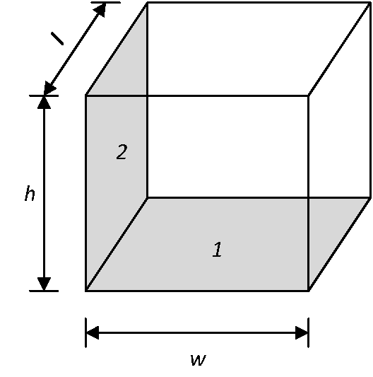
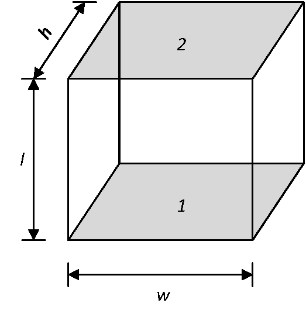

# ffpy

## About
A small Python library for calculating formfactors.

## Use

~~~python
from formfactor import ff_orthogonal_3D, ff_parallel_3D

# Formfactor between two finite, orthogonal rectangles sharing one complete edge with length l
ff_orthogonal_3D(w=1.0, l=1.0, h=1.0)
>> 0.20004377607540316

# Formfactor between two finite, parallel and identical rectangles separated by a distance l
ff_parallel_3D(w=1.0, h=1.0, l=1.0)
>> 0.19982489569838746

4 * ff_parallel_3D(w=1.0, h=1.0, l=1.0) + ff_orthogonal_3D(w=1.0, l=1.0, h=1.0)
>> 0.99934335886895298
~~~
